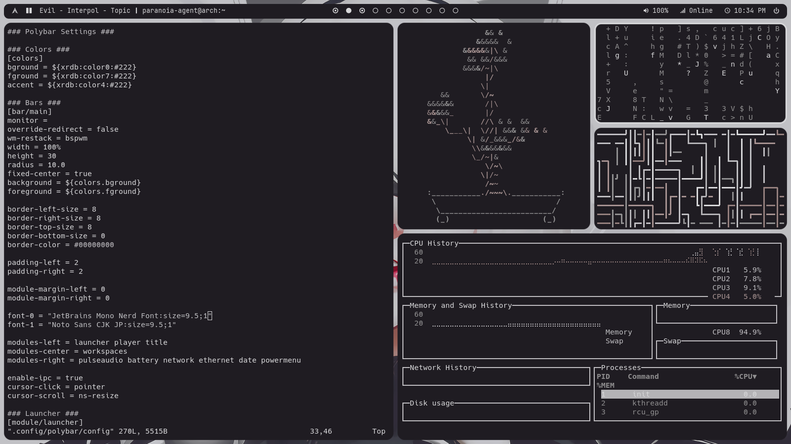

My current BSPWM config themed with pywal support. Mostly for personal use.

## Current Config

- Operating System
  - [Arch Linux](https://archlinux.org/)
- Window Manager
  - [BSPWM](https://github.com/baskerville/bspwm)
- Hotkey Daemon
  - [SXHKD](https://github.com/baskerville/sxhkd)
- Compositor
  - [Picom Jonaburg](https://github.com/jonaburg/picom)
- Bar
  - [Polybar](https://github.com/polybar/polybar)
  - [Playerctl](https://github.com/altdesktop/playerctl)
  - [Zscroll](https://github.com/noctuid/zscroll)
- Application Launcher
  - [Rofi](https://github.com/davatorium/rofi)
  - [Rofi Dmenu](https://aur.archlinux.org/packages/rofi-dmenu/)
  - [Networkmanager Dmenu](https://github.com/firecat53/networkmanager-dmenu)
- Notification Daemon
  - [Dunst](https://github.com/dunst-project/dunst)
- Screen Lock
  - [I3Lock Color](https://github.com/Raymo111/i3lock-color)
  - [Xidlehook](https://github.com/jD91mZM2/xidlehook)
- Power Management
  - [Xfce4 Power Manager](https://github.com/GalliumOS/xfce4-power-manager)
- Display Manager
  - [SDDM](https://github.com/sddm/sddm)
  - [Clairvoyance SDDM Theme](https://github.com/eayus/sddm-theme-clairvoyance)
- Terminal Emulator
  - [Kitty](https://github.com/kovidgoyal/kitty)
- File Manager
  - [Thunar](https://github.com/xfce-mirror/thunar)
  - [Thunar Archive Plugin](https://github.com/andreldm/thunar-archive-plugin)
  - [Ranger](https://github.com/ranger/ranger)
- Screenshots
  - [Flameshot](https://github.com/flameshot-org/flameshot)
- Matrix Client
  - [Mirage](https://github.com/mirukana/mirage)
- Shell Prompt
  - [Starship](https://github.com/starship/starship)
- Theming
  - [Pywal](https://github.com/dylanaraps/pywal)
  - [Feh](https://github.com/derf/feh)
  - [Themix GUI Designer](https://github.com/themix-project/oomox)
  - [Neofetch](https://github.com/dylanaraps/neofetch)
- Fonts
  - [Noto Fonts](https://archlinux.org/packages/extra/any/noto-fonts/)
  - [Noto Fonts CJK](https://archlinux.org/packages/extra/any/noto-fonts-cjk/)
  - [Nerd Fonts Hack](https://aur.archlinux.org/packages/nerd-fonts-hack/)
  - [Nerd Fonts Jetbrains Mono](https://aur.archlinux.org/packages/nerd-fonts-jetbrains-mono/)

## SXHKD Shortcuts

| Function                        | Keys                                     |
| ------------------------------- | ---------------------------------------- |
| Spawn Terminal                  | Super + Return                           |
| Spawn Browser                   | Super + W                                |
| Spawn File Manager              | Super + E                                |
| Launch Software                 | Super + Space                            |
| Lock Screen                     | Super + X                                |
| Screenshot                      | PrtSc                                    |
| Close/Kill Window               | Super + (Shift +) Q                      |
| Quit/Restart BSPWM              | Super + Ctrl + Q/R                       |
| Set Window States               | Super + F9/F10/F11                       |
| Toggle Tiled/Floating           | Super + D                                |
| Toggle Sticky                   | Super + Shift + D                        |
| Toggle Fullscreen               | Super + F                                |
| Toggle Monocle                  | Super + Shift + F                        |
| Move Node in Given Direction    | Super + Arrow Keys/Vim Keys              |
| Send Window in Given Direction  | Super + Shift + Arrow Keys/Vim Keys      |
| Preselect Window Split          | Super + Ctrl + Arrow Keys/Vim Keys       |
| Preselect Window Split Size     | Super + Ctrl + 1-9                       |
| Cancel Window Split             | Super + Ctrl + Space                     |
| Cycle Windows                   | Alt + (Shift +) Tab                      |
| Focus on Workspace              | Super + 1-0                              |
| Send to Workspace               | Super + Shift + 1-0                      |
| Resize Window                   | Super + Alt + Arrow Keys/Vim Keys        |
| Move Floating Window            | Super + Alt + Ctrl + Arrow Keys/Vim Keys |
| Window Selector                 | Super + Tab                              |
| Layout Flip                     | Super + A/S                              |
| Layout Rotation                 | Super + Shift + A/S                      |
| Reload SXHKD Files              | Super + Escape                           |

## Screenshots

#### Desktop

#### Tiling Windows

